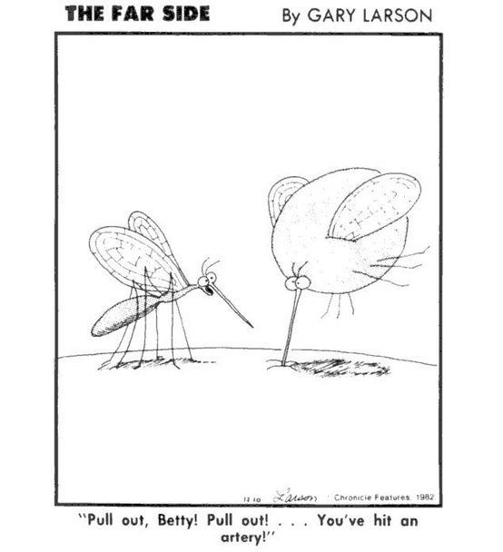

# Workshop outline

# Workshop documents

# Videos

# Bibliography

* Ward, R.A. 1984. Mosquito fauna of Guam: Case history of an introduced fauna, p. 143-161. /it-
Commerce and the spread of pests and disease vectors. M. Laird (Ed.). Praeger, New York.

* Kern-Allely, Stephanie. “<em>Notes from the Field</Em>: First Evidence of Locally Acquired Dengue Since 1944 — Guam, 2019.” MMWR. Morbidity and Mortality Weekly Report 69 (2020). https://doi.org/10.15585/mmwr.mm6913a4.

* Reeves, W. C., and A. Rudnick. “A Survey of the Mosquitoes of Guam in Two Periods in 1948 and 1949 and Its Epidemiological Implications.” The American Journal of Tropical Medicine and Hygiene, s1-31, no. 5 (1951): 633–58.

* Nowell, Wesley. “Vector Introduction and Malaria Infection on Guam.” Journal of the American Mosquito Control Association 3, no. 2 (1987): 259=265.

# Databases

## Global Biodiversity Information Facility (GBIF)

* [Culicidae occurrence records for Micronesia (Palau, FSM, Guam, CNMI, RMI), American Samoa, and Hawaii](https://www.gbif.org/occurrence/taxonomy?taxon_key=3346&gadm_gid=GUM&gadm_gid=PLW&gadm_gid=FSM&gadm_gid=MNP&gadm_gid=MHL)
* [Culicidae occurrence records for American Samoa](https://www.gbif.org/occurrence/taxonomy?taxon_key=3346&gadm_gid=ASM)
* [Culicidae occurrence records for Hawaii](https://www.gbif.org/occurrence/taxonomy?taxon_key=3346&gadm_gid=USA.12_1) 

